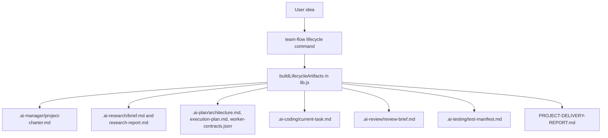

# Architecture

## Target Slice
Add a deterministic lifecycle generator to `mcp-servers/team-orchestrator/team-flow.js` and supporting pure functions in `mcp-servers/team-orchestrator/lib.js`.

The command will let a manager agent or non-technical user create a complete workflow archive from a plain idea:

```bash
node mcp-servers/team-orchestrator/team-flow.js lifecycle --idea "..."
```

## System Diagram


## Tech Stack
- Runtime: Node.js ESM, matching existing `team-orchestrator`.
- Dependencies: Node standard library only.
- Tests: Node built-in `node:test` runner to avoid dependency installation.
- CLI: Extend existing `team-flow.js` command dispatcher.

## Data Flow
1. Parse CLI flags: `--idea`, optional `--user`, `--constraints`, `--done`, `--output`.
2. Validate that `--idea` is present and meaningful.
3. Build lifecycle artifact contents in pure library functions.
4. Write artifacts into the output directory, defaulting to the current project root.
5. Print structured JSON listing generated files and validation status.

## Security Considerations
- No shell execution from user-provided idea text.
- No network calls from the lifecycle generator.
- All generated paths are fixed relative paths under the selected output directory.
- User input is stored as text, not executed.
- The command must not delete or overwrite unrelated source files.

## Undefined Dependencies
None. The implementation uses only local files and Node standard library APIs.
